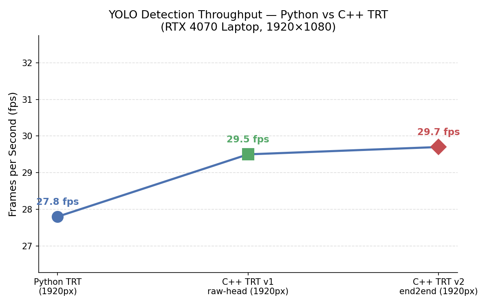
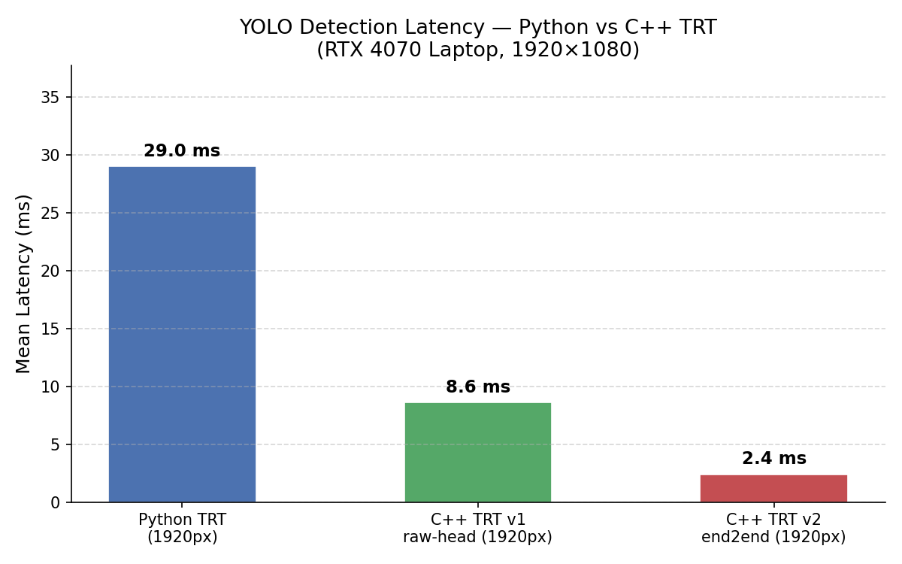

<p align="center">
  <h1 align="center">🤖 trt-trackbot</h1>
  <p align="center">
    <b>ROS 2 · TensorRT · YOLO · ByteTrack · LiDAR</b><br/>
    端到端 GPU 推理管线：摄像头图像 → 电机指令
  </p>
  <p align="center">
    <a href="README.md">🇬🇧 English README</a> ·
    <a href="#-快速启动">快速启动</a> ·
    <a href="#-性能测试">性能数据</a> ·
    <a href="#-系统架构">系统架构</a>
  </p>
  <p align="center">
    
    
    
    
    
    
  </p>
</p>

---

> **trt-trackbot** = TensorRT end2end 检测器（无 CPU NMS）+ C++ ByteTrack + FSM 控制器 + LiDAR 距离控制
>
> 完整 GPU 管线：`/camera/image_raw` → letterbox → TRT 推理 → EfficientNMS → ByteTrack → FSM → `/cmd_vel`

**trt-trackbot** 是一个 ROS 2 机器人项目，展示了如何在 GPU 加速的笔记本/嵌入式平台上构建实时、可交互的多目标跟踪系统。它面向希望在 TurtleBot3 上获得**可复现、可基准测试的视觉跟踪基线**的研究者和工程师——从原始摄像头输入到闭环电机控制的完整链路。

项目经历了三个检测后端的演进（Python TRT → C++ TRT v1 → C++ TRT v2 end2end），每个阶段都附有录制的基准数据，你可以清晰地研究各优化步骤的延迟和功耗权衡。控制器支持键盘驱动的目标锁定、LiDAR 距离调节和 EMA 滤波的偏航控制——全部集成在单个 C++ 节点中。

## ✨ 功能特性

| | 特性 | 说明 |
|---|------|------|
| 🎯 | **检测器** | YOLOv11n FP16 TensorRT end2end（内嵌 EfficientNMS_TRT，无 CPU NMS） |
| 🔄 | **追踪器** | ByteTrack — 纯 C++ 实现 |
| 🧠 | **控制器** | C++ FSM：Manual / Locked / Searching 三状态 |
| 📏 | **距离控制** | LiDAR `/scan` → 20th 百分位 ROI 距离 → PD 速度控制 |
| 🔢 | **槽位映射** | ByteTrack 大 ID（如 `1364`）→ 键盘友好的 1–9 槽位 |
| 🖼️ | **图像叠加** | 实时标注图像，发布于 `/tracker/overlay_image` |
| ⚡ | **推理速度** | Python TRT 29 ms → C++ TRT v1 8.6 ms → **C++ TRT v2 2.4 ms** |

---

## 🔧 环境要求

| 组件 | 版本 | 说明 |
|------|:----:|------|
| Ubuntu | **22.04** | |
| ROS 2 | **Humble** | 完整桌面版安装 |
| Gazebo | **Classic (11)** | 随 `turtlebot3-simulations` 一起安装 |
| CUDA | **12.x** | TensorRT 必需 |
| TensorRT | **8.6+** | NVIDIA 专有，需单独安装 |
| OpenCV | **4.x** | 通过 `ros-humble-cv-bridge` 获取 |
| Python | **3.10** | 用于基准测试 / 键盘脚本 |

### 第 1 步 — 安装 ROS 2 Humble

参考[官方安装指南](https://docs.ros.org/en/humble/Installation/Ubuntu-Install-Debians.html)，然后安装额外依赖：

```bash
sudo apt install \
  ros-humble-desktop \
  ros-humble-cv-bridge \
  ros-humble-image-transport \
  ros-humble-image-view \
  ros-humble-rqt-image-view
```

### 第 2 步 — 安装 TurtleBot3

```bash
sudo apt install ros-humble-turtlebot3 ros-humble-turtlebot3-simulations
echo 'export TURTLEBOT3_MODEL=waffle' >> ~/.bashrc
source ~/.bashrc
```

### 第 3 步 — 安装 TensorRT

从 [NVIDIA TensorRT 下载页](https://developer.nvidia.com/tensorrt) 下载匹配你 CUDA 版本的 `.deb` 安装包。

验证安装：
```bash
python3 -c "import tensorrt; print('TensorRT', tensorrt.__version__)"
```

### 第 4 步 — 编译 `yolo_msgs`（仅消息定义）

本项目使用 `yolo_msgs/DetectionArray` 作为检测器↔追踪器↔控制器的通信消息格式。**只需要消息包**，Python 版 yolo_ros 节点不需要。

```bash
mkdir -p ~/ros2_ws/src && cd ~/ros2_ws/src
git clone --depth 1 https://github.com/mgonzs13/yolo_ros.git
cd ~/ros2_ws
rosdep install --from-paths src --ignore-src -r -y
colcon build --packages-select yolo_msgs
source install/setup.bash
```

### 第 5 步 — 导出 YOLO TensorRT Engine

`.engine` 文件与你的 GPU SM 版本和 TensorRT 版本绑定，**不包含在仓库中**，必须在目标机器上重新生成：

```bash
pip install ultralytics

python3 - <<'EOF'
from ultralytics import YOLO
m = YOLO('yolo11n.pt')
m.export(
    format='engine',
    half=True,       # FP16
    imgsz=640,
    device=0,
    simplify=True,
    nms=True,        # 内嵌 EfficientNMS_TRT → v2 end2end
)
# 输出：yolo11n.engine（当前目录）
EOF
```

或使用项目自带脚本：
```bash
bash src/rtbot_yolo_trt_cpp/scripts/export_e2e.sh yolo11n.pt ~/engines/yolo11n_fp16.engine
```

> ⚠️ **务必在部署机器上重新生成 Engine。** 在不同 GPU 上编译的 engine 无法加载。

---

## 🔨 编译

```bash
# 1. 克隆仓库到 ROS 2 工作空间
mkdir -p ~/trt_ws/src
cd ~/trt_ws/src
git clone https://github.com/yanght24/trt-trackbot.git .

# 2. 加载 ROS 2 和 yolo_msgs 环境
source /opt/ros/humble/setup.bash
source ~/ros2_ws/install/setup.bash

# 3. 编译所有包
cd ~/trt_ws
colcon build --symlink-install

# 4. 加载工作空间
source install/setup.bash
```

> 💡 **出现 TensorRT 链接错误？** 确认 `libnvinfer.so` 在库路径中：
> ```bash
> export LD_LIBRARY_PATH=/usr/lib/x86_64-linux-gnu:$LD_LIBRARY_PATH
> ```

---

## 🚀 快速启动

每个终端都需要先执行以下环境加载：

```bash
# ── 每个新终端都粘贴这几行 ────────────────────────────────
source /opt/ros/humble/setup.bash
export TURTLEBOT3_MODEL=waffle
source ~/trt_ws/install/setup.bash
# ──────────────────────────────────────────────────────────
```

---

### 终端 1 — Gazebo 仿真

```bash
ros2 launch turtlebot3_gazebo turtlebot3_world.launch.py use_sim_time:=True
```

> ⏳ 等待 Gazebo 窗口完全打开、机器人出现后，再启动后续终端。

---

### 终端 2 — 动态巡逻实体 *(可选)*

向 Gazebo 世界中生成移动的行人和车辆模型，用于多目标测试：

```bash
python3 ~/trt_ws/src/sim_assets/scripts/patrol_entities.py
```

> 自定义 Gazebo 模型（`casual_female`、`person_walking`、`hatchback_blue` 等）已包含在 `sim_assets/models/` 中，无需额外下载。

---

### 终端 3 — TRT 检测器 + 追踪器

```bash
ros2 launch rtbot_yolo_trt_cpp rtbot_yolo_stack.launch.py \
  engine_path:=/path/to/yolo11n_fp16.engine \
  input_image_topic:=/camera/image_raw \
  threshold:=0.3 \
  use_sim_time:=True
```

将启动三个 C++ 节点：

| 节点 | 职责 |
|------|------|
| `detector_node` | TRT 推理（FP16 end2end） |
| `tracker_node` | ByteTrack 多目标追踪 |
| `debug_node` | 原始检测叠加（可选） |

正常启动输出：
```
[detector_node]: TRT engine loaded: yolo11n_fp16.engine
[detector_node]: Input: 1x3x640x640, Output: [num_dets, boxes, scores, labels]
[tracker_node]: ByteTrack initialized — max_age=30, min_hits=1
```

---

### 终端 4 — FSM 控制器

```bash
ros2 launch interactive_tracker_cpp tracker_system.launch.py
```

启动 `TrackerManagerNode`，参数从 `config/tracker_params.yaml` 加载。

正常启动输出：
```
[tracker_manager_node]: State: MANUAL
[tracker_manager_node]: Subscribed to /yolo/tracking, /scan, /camera/image_raw
```

---

### 终端 5 — 键盘控制

```bash
ros2 run interactive_tracker_cpp keyboard_command_node.py
```

终端实时显示槽位列表：

```
╔══════════════════════════════╗
║     检测到的目标              ║
╠══════════════════════════════╣
║  [1]  ID 1042   person       ║
║  [2]  ID 1364   person  ◀ 已锁定
║  [3]  ID 1071   car          ║
╚══════════════════════════════╝
状态：LOCKED  |  目标 ID：1364  |  距离：1.34 m
```

**键盘按键：**

| 按键 | 功能 |
|:----:|------|
| `1` – `9` | 锁定槽位 N 中的目标 |
| `u` | 解锁 → 返回 Manual 模式 |
| `s` | 进入 Searching 模式（原地旋转） |
| `w` | 手动前进 |
| `x` | 手动后退 |
| `a` | 手动左转 |
| `d` | 手动右转 |
| `q` | 退出 |

---

### 终端 6 — 叠加图像查看器 *(可选)*

查看带边界框、槽位编号、距离和锁定标识的实时标注图像：

```bash
ros2 run rqt_image_view rqt_image_view /tracker/overlay_image
```

或命令行无界面查看：
```bash
ros2 run image_view image_view --ros-args -r image:=/tracker/overlay_image
```

---

### 终端 7 — 性能基准测试 *(可选)*

先在终端 5 锁定一个目标，然后运行（需 ROS 2 环境）：

```bash
python3 ~/trt_ws/src/benchmarks/benchmark_tracker.py \
  --tag v2_1920 \
  --duration 30 \
  --warmup 5
```

结果保存至 `benchmarks/v2_1920/benchmark.json`。

对比多次测试结果：
```bash
python3 ~/trt_ws/src/benchmarks/benchmark_tracker.py \
  --compare py_1920 v1_1920 v2_1920
```

生成对比图表：
```bash
python3 docs/benchmark_chart.py
# → docs/benchmark_fps.png
# → docs/benchmark_latency.png
```

---

## 📡 话题参考

| 话题 | 类型 | 发布者 | 说明 |
|------|------|--------|------|
| `/camera/image_raw` | `sensor_msgs/Image` | Gazebo | 原始摄像头图像（1920×1080） |
| `/scan` | `sensor_msgs/LaserScan` | Gazebo | 360° LiDAR 扫描 |
| `/yolo/detections` | `yolo_msgs/DetectionArray` | `detector_node` | 原始 YOLO 检测框 |
| `/yolo/tracking` | `yolo_msgs/DetectionArray` | `tracker_node` | ByteTrack 输出（含稳定 ID） |
| `/user_command` | `std_msgs/String` | 键盘节点 | `lock:<ID>` / `slot:<N>` / `unlock` / `search` |
| `/manual_cmd_vel` | `geometry_msgs/Twist` | 键盘节点 | 手动速度输入 |
| `/cmd_vel` | `geometry_msgs/Twist` | `TrackerManagerNode` | 输出电机指令 |
| `/tracker/target_list` | `std_msgs/String` | `TrackerManagerNode` | JSON：槽位→ID 映射 + 锁定标志 |
| `/tracker/overlay_image` | `sensor_msgs/Image` | `TrackerManagerNode` | 标注后的摄像头图像 |
| `/tracker/target_distance` | `std_msgs/Float64` | `TrackerManagerNode` | LiDAR 测量的目标距离（m） |

---

## ⚙️ 参数配置

### 控制器 — `src/interactive_tracker_cpp/config/tracker_params.yaml`

```yaml
interactive_tracker:
  ros__parameters:

    # ── LiDAR 距离控制（主要） ────────────────────────────────
    desired_distance_m:     1.2      # 目标跟随距离（m）
    distance_kp:            0.6      # 比例增益
    distance_deadband_m:    0.10     # ±10 cm 死区

    # ── 偏航控制 ──────────────────────────────────────────────
    yaw_kp:                 0.001
    yaw_deadband_px:        50.0     # 像素
    max_angular_z:          0.6      # rad/s

    # ── EMA 平滑 ──────────────────────────────────────────────
    center_x_alpha:         0.5      # 目标中心 X 滤波系数
    angular_z_alpha:        0.7      # 角速度滤波系数

    # ── 目标生命周期 ──────────────────────────────────────────
    target_lost_timeout_sec:  1.0
    slot_release_timeout_sec: 2.0

    # ── 控制循环 ──────────────────────────────────────────────
    control_rate_hz:        20.0
```

### 检测器 — `src/rtbot_yolo_trt_cpp/config/stack.yaml`

```yaml
detector_node:
  ros__parameters:
    engine_path:      /path/to/yolo11n_fp16.engine   # ← 修改这里
    conf_threshold:   0.3
```

---

## ❓ 仓库中不包含的内容

| 缺失内容 | 原因 | 获取方式 |
|----------|------|---------|
| `*.engine` / `*.pt` / `*.onnx` | 二进制，与硬件绑定，>100 MB | 运行 `export_e2e.sh` 或 ultralytics 导出 |
| TurtleBot3 工作空间 | 通过 `apt` 安装 | `sudo apt install ros-humble-turtlebot3-simulations` |
| 完整 `yolo_ros` Python 节点 | 不需要，C++ 节点已替代 | 仅编译 `yolo_msgs`（第 4 步） |
| `benchmarks/*/benchmark.json` | 原始数据，本地重新生成 | 运行 `benchmark_tracker.py` |
| `docs/benchmark_*.png` | 从 JSON 生成 | 运行 `docs/benchmark_chart.py` |

---

## 📁 项目结构

```
trt-trackbot/
├── src/
│   ├── rtbot_yolo_trt_cpp/                 # 🔍 TRT 检测器 + C++ ByteTrack
│   │   ├── include/rtbot_yolo_trt_cpp/
│   │   │   ├── trt_backend.hpp             # TensorRT engine 封装
│   │   │   ├── detector_node.hpp           # V2 end2end 检测器
│   │   │   ├── tracker_node.hpp            # C++ ByteTrack
│   │   │   └── ...
│   │   ├── src/
│   │   │   ├── trt_backend.cpp
│   │   │   ├── detector_node.cpp
│   │   │   ├── tracker_node.cpp
│   │   │   └── ...
│   │   ├── config/
│   │   │   ├── detector.yaml               # V1 raw-head 参数
│   │   │   └── stack.yaml                  # V2 end2end 参数 ← 在此设置 engine_path
│   │   ├── launch/
│   │   │   ├── rtbot_yolo_trt.launch.py    # V1：C++ 检测器 + Python 追踪器
│   │   │   └── rtbot_yolo_stack.launch.py  # V2：全 C++ 栈 ← 推荐
│   │   └── scripts/
│   │       └── export_e2e.sh               # Engine 导出辅助脚本
│   │
│   └── interactive_tracker_cpp/            # 🎮 FSM 控制器 + 键盘节点
│       ├── include/interactive_tracker_cpp/
│       │   └── tracker_node.hpp
│       ├── src/
│       │   ├── tracker_node.cpp
│       │   └── main.cpp
│       ├── config/
│       │   └── tracker_params.yaml         # ← 在此调整控制参数
│       ├── launch/
│       │   └── tracker_system.launch.py
│       └── scripts/
│           └── keyboard_command_node.py
│
├── sim_assets/                             # 🌍 Gazebo 仿真资源
│   ├── models/                             # 自定义模型（已包含）
│   │   ├── casual_female/
│   │   ├── person_walking/
│   │   ├── hatchback_blue/
│   │   └── ...
│   ├── worlds/
│   │   └── flat_tracking.world             # 开阔竞技场测试世界
│   └── scripts/
│       └── patrol_entities.py
│
├── benchmarks/                             # 📈 性能测试工具
│   └── benchmark_tracker.py
│
├── docs/                                   # 📊 图表与资源
│   ├── benchmark_chart.py
│   ├── benchmark_fps.png
│   └── benchmark_latency.png
│
├── scripts/
│   └── env_setup.sh
│
├── LICENSE                                 # GPL-3.0-or-later
├── THIRD_PARTY_NOTICES.md
├── README.md                               # 英文文档
└── README_zh.md                            # 本文件（中文）
```

---

## 📦 第三方依赖

详见 [THIRD_PARTY_NOTICES.md](THIRD_PARTY_NOTICES.md)。

| 库 | 许可证 | 用途 |
|----|:------:|------|
| [yolo_ros](https://github.com/mgonzs13/yolo_ros) | GPL-3.0 | `yolo_msgs` 消息定义 |
| [ByteTrack](https://github.com/ifzhang/ByteTrack) | MIT | 多目标追踪算法 |
| [TurtleBot3](https://github.com/ROBOTIS-GIT/turtlebot3) | Apache-2.0 | 机器人仿真平台 |
| [OpenCV](https://github.com/opencv/opencv) | Apache-2.0 | 图像预处理与叠加绘制 |
| [TensorRT](https://developer.nvidia.com/tensorrt) | NVIDIA SLA | GPU 推理运行时 |
| ROS 2 Humble / rclcpp | Apache-2.0 | 机器人中间件 |

---

## 🎬 演示视频
该演示视频展示了系统在 **Manual / Locked / Searching** 三种模式之间的完整切换流程。

开始阶段为 **Manual** 模式，通过手动旋转视角完成目标选择；选中目标后，系统进入 **Locked** 模式并持续跟踪行人。当目标被树木暂时遮挡后，系统切换到 **Searching** 模式，通过旋转主动重新搜索目标；当目标再次被检测到后，系统重新进入 **Locked** 模式并继续稳定跟踪。

<p align="center">
  <a href="docs/demo.mp4">
    
  </a>
</p>

<p align="center">
  点击预览图即可观看或下载完整演示视频。
</p>

---

## 📊 性能测试

> 测试环境：**NVIDIA RTX 4070 Laptop GPU** · 分辨率：**1920 × 1080** · 稳定阶段录制 30 秒

| | 后端 | 平均 FPS | 平均延迟 | GPU 功耗 | GPU 利用率 | 相比基线 |
|:-:|:-----|:-------:|:-------:|:-------:|:---------:|:-------:|
| ❌ | Python TRT *(基线)* | 27.8 | 29.0 ms | 43.5 W | 41% | — |
| 🟡 | C++ TRT v1 *(raw-head)* | 29.5 | 8.6 ms | 26.1 W | 30% | 延迟 **−70%** |
| ✅ | **C++ TRT v2 *(end2end)*** | **29.7** | **2.4 ms** | **25.8 W** | **26%** | 延迟 **−92%**，功耗 **−41%** |

> 🚀 v2 end2end 将全部 NMS 移入 TensorRT（`EfficientNMS_TRT`），CPU 零后处理。
> **相比 Python 快 12× · 相比 C++ v1 快 3.6×**




<details>
<summary>重新生成性能对比图</summary>

```bash
python3 docs/benchmark_chart.py
# → docs/benchmark_fps.png
# → docs/benchmark_latency.png
```
</details>

---

## ⭐ Star History

[](https://star-history.com/#yanght24/trt-trackbot&Date)

---

## 📜 许可证

本项目基于 **GNU 通用公共许可证 v3.0 或更高版本** — 详见 [LICENSE](LICENSE)。

> ⚠️ 本项目链接了 NVIDIA TensorRT（专有软件）。用户须单独接受 [NVIDIA TensorRT 软件许可协议](https://developer.nvidia.com/nvidia-tensorrt-license-agreement)。

---

## 🙏 致谢

- [mgonzs13/yolo_ros](https://github.com/mgonzs13/yolo_ros)
- [ROBOTIS-GIT/turtlebot3](https://github.com/ROBOTIS-GIT/turtlebot3)
- [YaoFANG1997/TensorRT-For-YOLO-Series](https://github.com/YaoFANG1997/TensorRT-For-YOLO-Series)
